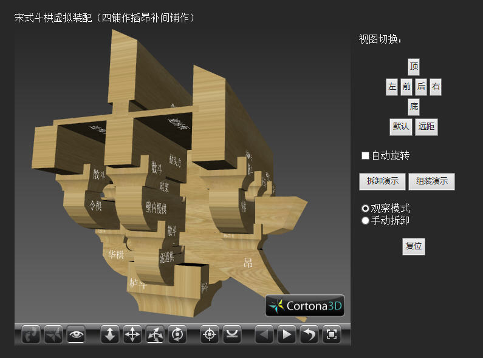
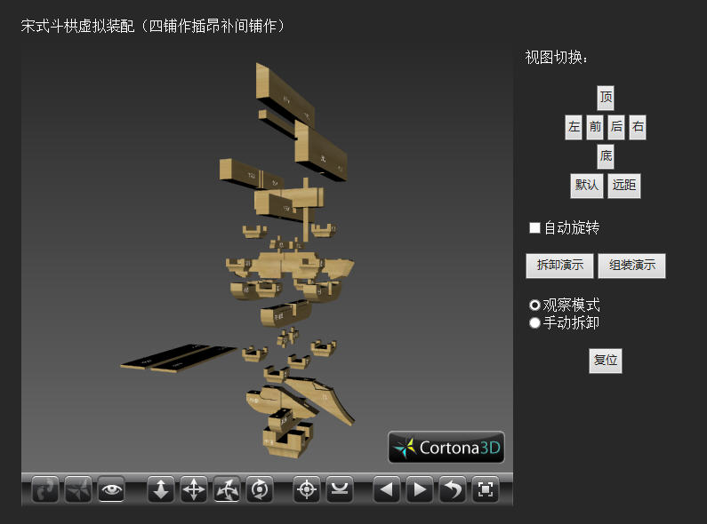

# 宋式斗�淼男槟庾芭洌ㄋ钠套鞑灏翰辜淦套鳎�
Author: Tom Willow

## 视频

Bilibili: [宋式斗��Web模型拆装演示（四铺作插昂补间铺作）](https://www.bilibili.com/video/BV1354y1a7uM/)

## 预览图

## 推荐浏览方式：

- 安装[Cortona3d Viewer](http://www.cortona3d.com/)，然后用浏览器打开index.html。

- 根据[Cortona3d官网](http://cortona3d.com/en/kb/articles/google-chrome-ends-support-npapi-plugins)，因为Google Chrome从42版本开始不再支持NPAPI plugins，所以暂时只能用其他浏览器观看（例如IE）。

## 特点：

- 模型精准。严格依照宋代《营造法式》标准，使用Pro/E参数化建模。模型大小按照 1分（宋代模数制单位）=0.01（VRML单位）制作。

- 中文标注零件名称。所有零件均附有中文名称标记，方便识别。

- 全分辨率支持。采用CSS+Javascript自适应技术，页面读取时根据可视范围大小自动调整排版，能够支持800x600至更高分辨率。推荐分辨率1366x768。

- 支持带碰撞检测的手动拆卸。采用Javascript读取所有零件坐标，设定装配坐标关系进行碰撞检测。

- 采用动态节点生成技术实现拆卸演示。

## 参考文献
[1] 潘德华. 斗�恚ㄉ稀⑾虏幔�[M]. 南京：东南大学出版社，2004

[2] 田永复. 中国仿古建筑精解[M]. 北京：化学工业出版社，2009

[3] 潘谷西，何建中. 营造法式解读[M]. 南京：东南大学出版社，2005

[4] 吴承洛. 中国度量衡史[M]. 上海：上海书店，1984